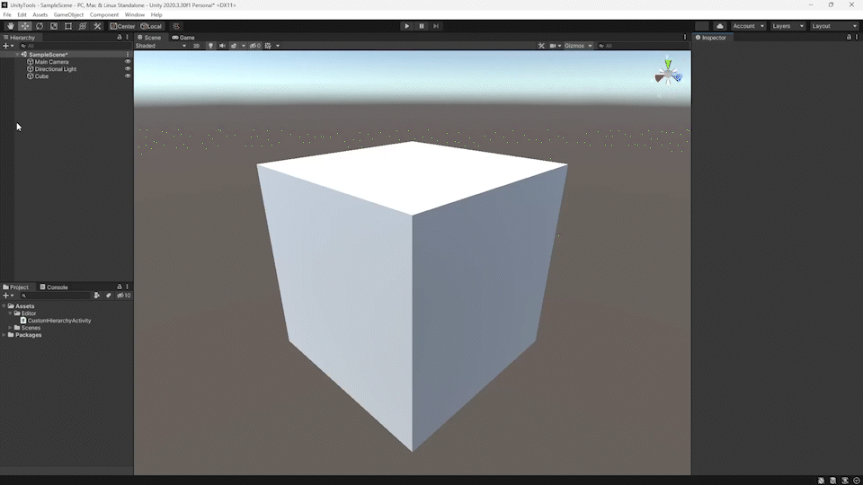

# Custom Hierarchy Activity Buttons

This is a simple Unity Editor extension that adds buttons to the hierarchy window to quickly enable/disable all components on a game object.

## Installation

1. Download the [latest release](https://github.com/alisahanyalcin/CustomHierarchyActivityButtons/releases) unity package.
2. Import the package into your project.
3. Done!

## Before Use

1. You have to create a new tag and name it as "Folder," otherwise, you will get an error.

## Usage

1. Select a game object in the hierarchy window.
2. Click on the desired button in the hierarchy window toolbar.
3. Done!
